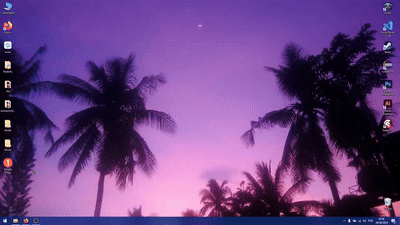

## Timer com Temático de Tomate

Este é um projeto desenvolvido em Delphi Pascal que consiste em um timer para alternar entre períodos de sprint e estudo, inspirado na técnica de gerenciamento de tempo, mas sem utilizar o nome "Pomodoro". A temática é de tomate, com elementos visuais e animações que remetem a esse conceito. 

### Funcionalidades Implementadas:
- **Timer**: Contagem regressiva para os períodos de sprint e estudo.
- **Pausa Curta**: Intervalos curtos entre os sprints.
- **Pausa Longa**: Intervalos mais longos após um conjunto de sprints.
- **Sprint**: Fases de trabalho focado.
- **Animação de Progresso**: Indicação visual do progresso do tempo.

### Próximas Implementações:
- **Som de Alarme**: Alerta sonoro ao final de cada período.

## Tomato-Themed Timer

This is a project developed in Delphi Pascal, consisting of a timer for alternating between sprint and study periods, inspired by a time management technique, but without using the "Pomodoro" name. The theme is tomato-based, with visual elements and animations related to this concept.

### Implemented Features:
- **Timer**: Countdown for sprint and study periods.
- **Short Break**: Short breaks between sprints.
- **Long Break**: Longer breaks after a set of sprints.
- **Sprint**: Focused work phases.
- **Progress Animation**: Visual indication of time progress.

### Upcoming Features:
- **Alarm Sound**: Sound alert at the end of each period.

